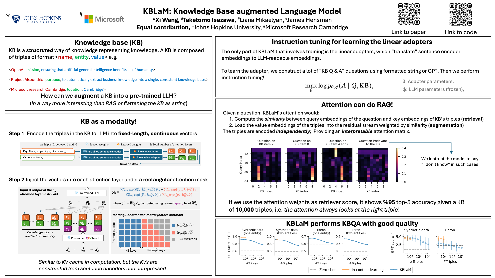
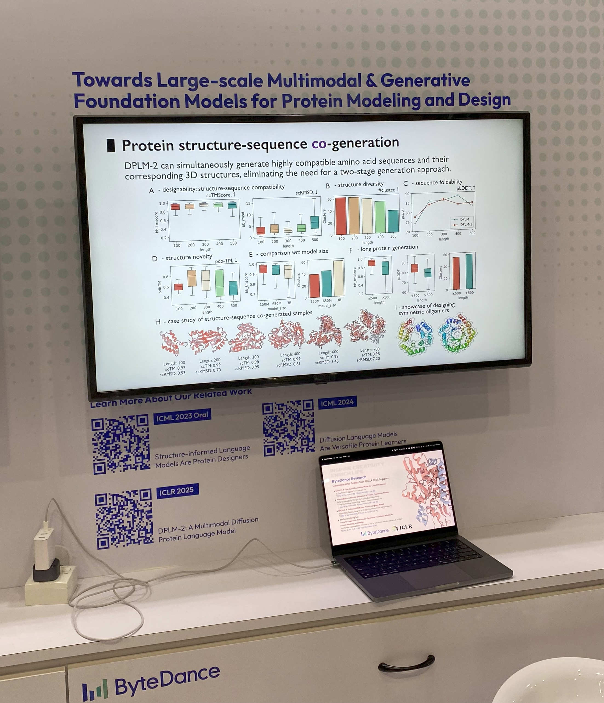

# International Conference on Learning Representations 2025
- **Location:** Singapore EXPO
- **Dates:** April 24-28

*Prepared by [Your Name], [Your Affiliation], [Date]*

# Conference (April 24-26)

- **🔴 Large Language Models (LLMs)**
- **🟠 Generative Models**
- **🟡 Multimodal Learning**
- **🟢 Physics-Informed Machine Learning**
- **🔵 Data-Centric Machine Learning**
- **🟣 Optimization & Theory**
- **🟤 Applications in Science & Engineering**
- **⚫ Foundation Models**
---
- **🌟 Connection**
---

### 

| Task | Title | Poster | Keyword | Summary |
|-------|-------|--------|---------|------|
| 🟢 **Inverse Problem** | [Physics-Informed Deep Inverse Operator Networks for Solving PDE Inverse Problems](https://openreview.net/forum?id=0FxnSZJPmh) |  | Inverse Problems, Stability, Operator Learning, Physics-Informed ML | Proposes PI-DIONs architecture for learning solution operators of PDE-based inverse problems without labeled data. |
| 🟡🟤 **Procedural Material Generation** | [VLMaterial: Procedural Material Generation with Large Vision-Language Models](https://openreview.net/forum?id=wHebuIb6IH) |  | Generative Model, Procedural Material, Appearance Modeling | Leverages large vision-language models to generate procedural materials from input images, enabling intuitive and precise editing for photorealistic material appearance design. Introduces an open-source procedural material dataset and program-level augmentation techniques. |
| 🟢 **PINNs Optimization** | 🌟[ANaGRAM: A Natural Gradient Relative to Adapted Model for efficient PINNs learning](https://openreview.net/forum?id=o1IiiNIoaA) |  | Natural Gradient, PINNs, PDEs, Neural Tangent Kernel | Introduces ANaGRAM, a novel natural gradient optimization algorithm tailored for Physics-Informed Neural Networks (PINNs). The method scales efficiently with model parameters and batch size, enhancing training speed and accuracy. It also provides a mathematically principled reformulation of the PINNs problem, connecting to Green's function theory. |
| 🟡🟤 **Crystal Generation** | [A Periodic Bayesian Flow for Material Generation](https://openreview.net/forum?id=Lz0XW99tE0) |  | Crystal Generation, Bayesian Flow Networks, Entropy Conditioning, Non-Euclidean Geometry | Introduces CrysBFN, a novel crystal generation method employing a periodic Bayesian flow with entropy conditioning. Achieves state-of-the-art performance and a 200× sampling efficiency improvement over prior diffusion-based methods. |
| 🟡🟤⚫ **Distribution of Biomolecular Density Map** | [CryoFM: A Flow-based Foundation Model for Cryo-EM Densities](https://openreview.net/forum?id=T4sMzjy7fO) |  | Cryo-EM, Flow Matching, Foundation Model, Biomolecular Density | Introduces CryoFM, a generative foundation model trained on high-quality cryo-EM density maps using flow matching. Demonstrates state-of-the-art performance across multiple downstream tasks in cryo-EM and cryo-ET without fine-tuning, highlighting its potential as a versatile tool in structural biology. |
| 🟡🟤 **3D Molecule Generation** | [Accelerating 3D Molecule Generation via Jointly Geometric Optimal Transport](https://openreview.net/forum?id=VGURexnlUL) |  | Molecule Generation, Flow Matching, Optimal Transport, Equivariant Networks | Proposes GOAT, a 3D molecule generation framework leveraging flow-matching optimal transport. Introduces a geometric transport formula for multi-modal features, solved within an equivariant latent space. Incorporates optimal coupling estimation and purification, achieving faster generation with improved validity, uniqueness, and novelty. |
| 🟢🟣 **Active Learning for Neural PDE Solvers** | [Active Learning for Neural PDE Solvers](https://openreview.net/forum?id=x4ZmQaumRg) |  | Active Learning, Neural PDE Solvers, Surrogate Modeling, Scientific Machine Learning | Introduces AL4PDE, a modular benchmark for evaluating active learning strategies in neural PDE solvers. Demonstrates that active learning can reduce average errors by up to 71% compared to random sampling, enhancing data efficiency in scientific simulations. |
| 🟡🟤 **Crystal Symmetry Classification** | 🌟[SimXRD-4M: Big Simulated X-ray Diffraction Data and Crystal Symmetry Classification Benchmark](https://openreview.net/forum?id=mkuB677eMM) |  | X-ray Diffraction, Crystal Symmetry, Benchmark Dataset, Long-tailed Distribution | Introduces SimXRD-4M, the largest open-source simulated powder XRD dataset with over 4 million patterns across 119,569 unique crystal structures. Benchmarks 21 sequence models, highlighting challenges in classifying low-frequency crystals and demonstrating generalization to real experimental data. |
| 🟡🟤 **Protein Structure Generation** | [ProtComposer: Compositional Protein Structure Generation with 3D Ellipsoids](https://openreview.net/forum?id=0ctvBgKFgc) | **Oral&Poster**  | Protein Design, Diffusion Models, Controllable Generation, Structural Biology | Introduces ProtComposer, a framework for generating protein structures conditioned on spatial layouts specified via 3D ellipsoids. Enables controllable design by allowing users to define substructure properties such as location, size, and orientation. Demonstrates improved diversity and designability in generated proteins compared to existing models. |
| 🟠🟤 **Bioisosteric Drug Design** | [ShEPhERD: Diffusing shape, electrostatics, and pharmacophores for bioisosteric drug design](https://openreview.net/forum?id=KSLkFYHlYg) | **Oral&Poster**  | 3D Molecular Generation, Diffusion Models, Pharmacophore Modeling, SE(3)-Equivariance | Introduces ShEPhERD, a diffusion model that jointly generates 3D molecular structures and their interaction features, enabling the design of bioisosteric analogues with desired 3D interaction profiles. Demonstrates applications in ligand hopping, bioactive hit diversification, and fragment merging. |
| 🔵🟠 **Data Valuation for Generative Models** | 🌟[GMValuator: Similarity-based Data Valuation for Generative Models](https://openreview.net/forum?id=WncnpvJk83) |  | Data Valuation, Generative Models, Similarity Matching, Image Quality Assessment | Introduces GMValuator, a training-free and model-agnostic approach for data valuation in image generation tasks. Utilizes a similarity matching module and image quality assessment to attribute contributions of training samples to generated outputs. Demonstrates effectiveness across various generative architectures and datasets. |
| 🔴🟠 **Workflow Orchestration with LLMs** | [WorkflowLLM: Enhancing Workflow Orchestration Capability of Large Language Models](https://openreview.net/forum?id=3Hy00Wvabi) |  | Workflow Automation, LLM Fine-tuning, API Tool Learning, Dataset Construction | Introduces WorkflowLLM, a framework that enhances LLMs' ability to orchestrate complex workflows by constructing a large-scale dataset, WorkflowBench, and fine-tuning Llama-3.1-8B, resulting in WorkflowLlama with strong generalization and zero-shot capabilities.|
| 🔴🟡🟠 **Efficient Multimodal Modeling** | [LLaVA-Mini: Efficient Image and Video Large Multimodal Models with One Vision Token](https://openreview.net/forum?id=UQJ7CDW8nb) |  | Multimodal Learning, Vision-Language Models, Token Compression, Real-Time Processing | Proposes LLaVA-Mini, a large multimodal model that introduces modality pre-fusion to reduce vision tokens to one, achieving 77% FLOPs reduction and maintaining performance across image and video tasks. |
| 🔴🟠🟤 **Zero-Shot Protein Fitness Prediction** | [Protein Language Model Fitness is a Matter of Preference](https://openreview.net/forum?id=UvPdpa4LuV) |  | Protein Language Models, Zero-Shot Prediction, Sequence Likelihood, Fine-Tuning | Investigates the conditions under which protein language models can accurately perform zero-shot fitness estimation. Finds that the likelihood of a protein sequence, as determined during pretraining, predicts fitness prediction capabilities. Highlights that both over- and under-preferred sequences can harm performance, and that unsupervised fine-tuning can improve predictions for low-likelihood sequences. |
| 🟢🟣 **Memory-Augmented Neural Operators for PDEs** | [On the Benefits of Memory for Modeling Time-Dependent PDEs](https://openreview.net/forum?id=o9kqa5K3tB) | **Oral&Poster**  | Neural Operators, Memory Mechanisms, Time-Dependent PDEs, Fourier Neural Operator, State Space Models | Introduces MemNO, a neural operator architecture combining Fourier Neural Operators and state space models to incorporate memory for modeling time-dependent PDEs. Demonstrates significant performance improvements, especially in low-resolution or noisy settings, and provides theoretical insights based on the Mori-Zwanzig formalism. |
| 🟠🟤 **Topology-Constrained Image Generation** | [TopoDiffusionNet: A Topology-aware Diffusion Model](https://openreview.net/forum?id=ZK1LoTo10R) |  | Diffusion Models, Topological Constraints, Persistent Homology, Generative Modeling | Introduces TopoDiffusionNet, a diffusion model that integrates topological constraints into the image generation process using persistent homology. Demonstrates improved topological accuracy across multiple datasets, enabling applications requiring precise structural control. |
| 🟠 **3D and 4D Scene Generation** | [GenXD: Generating Any 3D and 4D Scenes](https://openreview.net/forum?id=1ThYY28HXg) |  | 3D Generation, 4D Generation, Diffusion Models, Multiview-Temporal Modules | Introduces GenXD, a framework for generating 3D and 4D scenes by disentangling camera and object movements. Proposes a data curation pipeline to obtain camera poses and object motion strength from videos, leading to the creation of the CamVid-30K dataset. Demonstrates effectiveness across various real-world and synthetic datasets. |
| 🟠🟣 **Theoretical Framework for Discrete Diffusion Models** | [How Discrete and Continuous Diffusion Meet: Comprehensive Analysis of Discrete Diffusion Models via a Stochastic Integral Framework](https://openreview.net/forum?id=6awxwQEI82) |  | Discrete Diffusion Models, Stochastic Integrals, Poisson Processes, Error Analysis | Proposes a rigorous framework for analyzing discrete diffusion models using Lévy-type stochastic integrals. Establishes analogies with Itô integrals and Girsanov's theorem, providing the first KL divergence error bound for the τ-leaping scheme and offering insights into the design of efficient algorithms for discrete diffusion applications. |
| 🔴🟠🟣 **Energy-Based Diffusion for Text Generation** | [Energy-Based Diffusion Language Models for Text Generation](https://openreview.net/forum?id=sL2F9YCMXf) |  | Discrete Diffusion Models, Energy-Based Models, Language Modeling, Noise Contrastive Estimation | Proposes EDLM, integrating energy-based modeling into discrete diffusion frameworks for text generation. Demonstrates improved performance and sampling efficiency over existing diffusion models, approaching the perplexity of autoregressive models. |
| 🟠🟤 **Protein Family Generation via Bayesian Flow** | [Steering Protein Family Design through Profile Bayesian Flow](https://openreview.net/forum?id=PSiijdQjNU) |  | Protein Design, Bayesian Flow Networks, MSA Profiles, Generative Modeling | Introduces ProfileBFN, a method for efficient protein family generation by extending discrete Bayesian Flow Networks from an MSA profile perspective, enabling training on single sequences and capturing structural characteristics of protein families. |
| 🟠🟤 **Scalable Flow-Based Protein Generation** | [Proteina: Scaling Flow-based Protein Structure Generative Models](https://openreview.net/forum?id=TVQLu34bdw) |  | Protein Structure Generation, Flow Matching, Hierarchical Conditioning, Transformer Architecture | Introduces Proteina, a flow-based protein backbone generator utilizing hierarchical fold class labels and a scalable transformer architecture. Achieves state-of-the-art performance in de novo protein design, producing diverse and designable proteins up to 800 residues in length. |
| 🟢🟣 **Equation-Free Modeling of Spatiotemporal Dynamics** | [TRENDy: Temporal Regression of Effective Nonlinear Dynamics](https://openreview.net/forum?id=NvDRvtrGLo) |  | Spatiotemporal Dynamics, Neural ODEs, Bifurcation Analysis, Multiscale Filtering | Introduces TRENDy, an equation-free method that learns reduced-order models of PDEs for robust bifurcation prediction. Demonstrates effectiveness across synthetic and real datasets, including the analysis of spatial patterning in the ocellated lizard. |
| 🟢🟣 **Physics-Informed Deep Inverse Operators** | [Physics-Informed Deep Inverse Operator Networks for Solving PDE Inverse Problems](https://openreview.net/forum?id=0FxnSZJPmh) |  | Inverse Problems, Operator Learning, Physics-Informed Machine Learning, Stability Estimates | Proposes PI-DIONs, a framework that learns solution operators for PDE-based inverse problems without labeled data. Extends stability estimates to the operator learning setting, ensuring robust generalization across domains. |
| 🟢🟣 **Text-Conditioned Simulation**| 🌟[Text2PDE: Latent Diffusion Models for Accessible Physics Simulation](https://openreview.net/forum?id=Nb3a8aUGfj) |  | Latent Diffusion, PDE Simulation, Neural Operators, Text2PDE | Introduces text-conditioned latent diffusion models enabling accessible and efficient physics simulations from textual descriptions.|
| 🟢🟣 **Clifford Neural Operators for 3D CFD** | [Fengbo: a Clifford Neural Operator pipeline for 3D PDEs in Computational Fluid Dynamics](https://openreview.net/forum?id=VsxbWTDHjh) |  | Clifford Algebra, Neural Operators, 3D PDEs, Computational Fluid Dynamics, Fourier Neural Operator | Introduces Fengbo, a neural operator architecture leveraging Clifford Algebra to solve 3D PDEs in CFD. Achieves competitive accuracy with 42M parameters, outperforming five out of six models on the ShapeNet Car dataset, and offers interpretable 3D visualizations of physical quantities. |
| 🔴🟤 **Benchmarking Language Agents for Scientific Discovery** | [ScienceAgentBench: Toward Rigorous Assessment of Language Agents for Data-Driven Scientific Discovery](https://openreview.net/forum?id=6z4YKr0GK6) |  | Language Agents, Scientific Workflows, Code Generation, Benchmarking | Introduces ScienceAgentBench, a benchmark evaluating language agents on 102 tasks derived from scientific publications. Highlights current limitations, with top agents solving only ~34% of tasks, underscoring the need for further advancements in automating scientific discovery. |
| 🟢🟣 **Physics-Informed Neural Prediction of Fluid Dynamics** | 🌟[PINP: Physics-Informed Neural Predictor with latent estimation of fluid flows](https://openreview.net/forum?id=vAuodZOQEZ) |  | Fluid Dynamics, Spatiotemporal Prediction, Physics-Informed Learning, PDE Integration | Proposes PINP, a physics-informed learning approach that integrates discretized physical equations into neural networks, enabling robust long-term predictions of fluid dynamics and inference of latent physical quantities. Demonstrates state-of-the-art performance in spatiotemporal prediction tasks. |
| 🟢🟣 **Physics-Informed Diffusion Models** | [Physics-Informed Diffusion Models](https://openreview.net/forum?id=tpYeermigp) |  | Diffusion Models, Physics-Informed Learning, PDE Constraints, Generative Modeling | Introduces a framework that integrates PDE constraints into diffusion models via a first-principle-based loss term, enhancing the physical fidelity of generated samples and providing regularization benefits. Demonstrates superior performance in fluid dynamics and structural optimization tasks. |
| 🟠🟤 **Unified Framework for Docking and 3D Drug Design** | [3DMolFormer: A Dual-channel Framework for Structure-based Drug Discovery](https://openreview.net/forum?id=RgE1qiO2ek) |  | Protein-Ligand Docking, 3D Molecule Generation, Transformer Architecture, Dual-Channel Modeling | Introduces 3DMolFormer, a dual-channel transformer framework that simultaneously addresses protein-ligand docking and pocket-aware 3D drug design. Utilizes parallel sequences of discrete tokens and continuous numbers to represent 3D complexes, overcoming challenges in 3D information modeling and data limitations. Demonstrates superior performance over existing methods in structure-based drug discovery tasks. |
| 🔴🟠 **Knowledge Base Augmentation for LLMs** | [KBLaM: Knowledge Base augmented Language Model](https://openreview.net/forum?id=aLsMzkTej9) |  | Large Language Models, Knowledge Augmentation, Rectangular Attention, Key-Value Vectors | Introduces KBLaM, a method for integrating external knowledge bases into LLMs without traditional retrieval or in-context learning. Transforms knowledge triples into continuous vectors and incorporates them via specialized attention mechanisms, enabling efficient and dynamic knowledge integration. |
| 🔴🟡🟤⚫ **Multimodal Contrastive Learning for Antibiotic Discovery** | [CL-MFAP: A Contrastive Learning-Based Multimodal Foundation Model for Molecular Property Prediction and Antibiotic Screening](https://openreview.net/forum?id=fv9XU7CyN2) |  | Contrastive Learning, Multimodal Foundation Model, Antibiotic Property Prediction, Bi-level Routing Attention, Transformer | Introduces CL-MFAP, an unsupervised contrastive learning-based multimodal foundation model tailored for discovering small molecules with potential antibiotic properties. Utilizes 1.6 million bioactive molecules from the ChEMBL dataset to jointly pretrain three encoders handling SMILES strings, molecular graphs, and Morgan fingerprints. Demonstrates superior performance in antibiotic property prediction tasks. |
| 🟠🟤 **Retrieval-Augmented Antibody Design via Diffusion** | [Retrieval Augmented Diffusion Model for Structure-informed Antibody Design and Optimization](https://openreview.net/forum?id=a6U41REOa5) |  | Antibody Design, Diffusion Models, Retrieval-Augmented Generation, Structural Motifs | Introduces RADAb, a retrieval-augmented diffusion framework that guides antibody design using structural homologous motifs. Integrates structural and evolutionary information through a dual-branch denoising module, achieving state-of-the-art performance in antibody inverse folding and optimization tasks. |
| 🔴🟠🟡🟤⚫ **Multimodal Protein Sequence and Structure Generation** | 🌟[DPLM-2: A Multimodal Diffusion Protein Language Model](https://openreview.net/forum?id=5z9GjHgerY) |  | Protein Language Models, Diffusion Models, Sequence-Structure Modeling, Quantization | Introduces DPLM-2, a multimodal protein foundation model that extends discrete diffusion protein language models to accommodate both sequences and structures. Utilizes a lookup-free quantization-based tokenizer to convert 3D coordinates into discrete tokens, enabling joint modeling of sequence and structure. Demonstrates competitive performance in tasks like folding, inverse folding, and motif scaffolding. |
| 🟡🟤⚫ **Distilling MLFFs Foundation Models** | [Towards Fast, Specialized Machine Learning Force Fields: Distilling Foundation Models via Energy Hessians](https://openreview.net/forum?id=1durmugh3I) | Oral&Poster  | Machine Learning Force Fields, Knowledge Distillation, Energy Hessians, Computational Chemistry | Proposes a method to distill large MLFF foundation models into smaller, specialized models using energy Hessians. Achieves up to 20x speedups while maintaining or exceeding original model accuracy, facilitating efficient and accurate simulations in specific chemical domains. |
| 🟢🟣 **Sensitivity-Constrained Fourier Neural Operators** | 🌟[Sensitivity-Constrained Fourier Neural Operators for Forward and Inverse Problems in Parametric Differential Equations](https://openreview.net/forum?id=DPzQ5n3mNm) |  | Fourier Neural Operator, Sensitivity Analysis, Parametric Differential Equations, Inverse Problems | Introduces SC-FNO, enhancing the accuracy of parametric differential equation solutions and their sensitivities using a novel sensitivity loss regularizer. Demonstrates superior performance in inverse problems and sensitivity calculations, accommodating complex parameter spaces and reducing training data requirements. |
| 🟠🟤 **Topology-Guided Protein Backbone Generation** | [ProtPainter: Draw or Drag Protein via Topology-guided Diffusion](https://openreview.net/forum?id=Nq7yKYL0Bp) |  | Protein Backbone Generation, Conditional Diffusion, Topology Control, Protein Editing | Introduces ProtPainter, a diffusion-based method for generating protein backbones conditioned on 3D curves. Employs CurveEncoder for sketch generation and a Helix-Gating scheme during DDPM-based backbone generation. Demonstrates high topology fitness and designability in generated proteins. |
| 🟠🟤 **Triplet-Based Preference Learning for Protein Design** | [Data Distillation for Extrapolative Protein Design through Exact Preference Optimization](https://openreview.net/forum?id=ua5MHdsbck) |  | Protein Design, Preference Learning, Triplet Optimization, Extrapolation | Introduces a triplet-based preference learning approach to enhance protein design, enabling better extrapolation to higher fitness regions. Demonstrates significant improvements in designing AAV and GFP proteins by distilling relevant triplet relations into the model. |
| 🟢🟣 **Sampling Fluid Flow Distributions via Diffusion Graph Networks** | [Learning Distributions of Complex Fluid Simulations with Diffusion Graph Networks](https://openreview.net/forum?id=uKZdlihDDn) |  | Fluid Dynamics, Latent Diffusion, Graph Neural Networks, Unstructured Meshes | Proposes a graph-based latent diffusion model that enables direct sampling of fluid flow states from their equilibrium distribution, given a mesh discretization of the system and its physical parameters. Demonstrates efficient computation of flow statistics without running long simulations, operating effectively on unstructured meshes and accurately learning full distributions even from incomplete data. |

## 📌**JP**

| Label | Title | Figure | Keyword | Note |
|-------|-------|--------|---------|------|
| NTT   **Diffusion Model/Image generation** | [Positive-Unlabeled Diffusion Models for Preventing Sensitive Data Generation](https://openreview.net/forum?id=jKcZ4hF4s5) |  | Diffusion Models, Positive-Unlabeled Learning, Sensitive Data Mitigation, ELBO Approximation | Proposes a diffusion model that uses positive-unlabeled learning to prevent the generation of sensitive data. Demonstrates effectiveness across various datasets without compromising image quality. |
| SONY AI   **Multimodal/CLIP** | [Weighted Point Set Embedding for Multimodal Contrastive Learning Toward Optimal Similarity Metric](https://openreview.net/forum?id=uSz2K30RRd) |  | Multimodal Contrastive Learning, Weighted Point Sets, Symmetric InfoNCE, Pointwise Mutual Information | Proposes WPSE, a method representing each input as a weighted set of vectors to capture richer similarity structures. Theoretically demonstrates that this approach aligns with pointwise mutual information and provides upper bounds on excess risk in downstream tasks. Empirical evaluations show improved performance over CLIP on various benchmarks. |
| OMRON   **Dynamic Frame-Based Crystal Structure Modeling** | [Rethinking the Role of Frames for SE(3)-Invariant Crystal Structure Modeling](https://openreview.net/forum?id=gzxDjnvBDa) |  | Crystal Structure Modeling, Graph Neural Networks, SE(3) Invariance, Dynamic Frames | Introduces CrystalFramer, a GNN architecture that constructs dynamic, attention-guided local frames for each atom, enhancing SE(3)-invariant representation of crystal structures. Demonstrates superior performance in predicting various crystal properties compared to traditional frame-based methods. |
| Nivdia   **Annotation-Free Debiasing of CLIP** | 🌟[SANER: Annotation-free Societal Attribute Neutralizer for Debiasing CLIP](https://openreview.net/forum?id=x5hXkSMOd1) |  | Societal Bias, CLIP, Debiasing, Fairness, Attribute Neutralization | Proposes SANER, a method to mitigate societal biases in CLIP without requiring attribute annotations. Removes attribute information from text features of attribute-neutral descriptions while preserving attribute-specific information, outperforming existing debiasing methods. |

## 📌**Google**

### https://research.google/conferences-and-events/google-at-iclr-2025/
### Google Cloud

  

## 📌**Meta**

| ID   | Title                                                                                                  |
|------|--------------------------------------------------------------------------------------------------------|
| 335  | [Backtracking Improves Generation Safety](https://arxiv.org/abs/2409.14586)                                                        |
| 77   | [SAM 2: Segment Anything in Images and Videos](https://arxiv.org/abs/2408.00714)                                                   |
| 249  | [Transfusion: Predict the Next Token and Diffuse Images with One Multi-Modal Model](https://arxiv.org/abs/2408.11039)              |
| 627  | [MaestroMotif: Skill Design from Artificial Intelligence Feedback](https://arxiv.org/abs/2412.08542)     |
| 172  | [Generator Matching: Generative modeling with arbitrary Markov processes](https://arxiv.org/abs/2410.20587)                        |
| 191  | [Flow Matching with General Discrete Paths: A Kinetic-Optimal Perspective](https://arxiv.org/abs/2412.03487)                       |
| 404  | [Towards General-Purpose Model-Free Reinforcement Learning](https://arxiv.org/abs/2501.16142)                                      |
| 154  | [DRoP: Distributionally Robust Data Pruning](https://arxiv.org/abs/2404.05579)                                                     |
| 536  | [Strong Model Collapse](https://arxiv.org/abs/2410.04840)                                                                          |
| 35   | [PARTNR: A Benchmark for Planning and Reasoning in Embodied Multi-agent Tasks](https://arxiv.org/abs/2411.00081)                  |
| 177  | [Adjoint Matching: Fine-tuning Flow and Diffusion Generative Models with Memoryless Stochastic Optimal Control](https://arxiv.org/abs/2409.08861) |

## 📌**ByteDance**

### ✒️Research Scientist: [Zaixiang Zheng](https://zhengzx-nlp.github.io/)

### Towards Large-scale Multimodal & Generative Foundation Models for Protein Modeling and Design

- [ICML2023 Oral] [Structure-informed Language Models Are Protein Designers](https://arxiv.org/abs/2302.01649)
- [ICML2024] [Diffusion Language Models Are Versatile Protein Learners](https://arxiv.org/abs/2402.18567)
- [**ICLR2025**] [DPLM-2: A Multimodal Diffusion Protein Language Model](https://arxiv.org/abs/2410.13782)
  

  

### Generative AI for Science at ByteDance Research

#### Protein foundation and functional design

- [Structure-informed Language Models Are Protein Designers](https://arxiv.org/abs/2302.01649) , *ICML 2023 (oral)*
- [Diffusion Language Models Are Versatile Protein Learners](https://arxiv.org/abs/2402.18567) , *ICML 2024*
- **[DPLM-2: A Multimodal Diffusion Protein Language Model](https://arxiv.org/abs/2410.13782)** , ***ICLR 2025***
- [Elucidating the Design Space of Multimodal Protein Language Models](https://arxiv.org/abs/2504.11454) , *Preprint/arXiv:2504.14545, ICML 2025*
- [AbPO: Antigen-Specific Antibody Design via Direct Energy-based Preference Optimization](https://arxiv.org/abs/2403.16576)  , *NeurIPS 2024*
- [An All-Atom Generative Model for Designing Protein Complexes](https://arxiv.org/abs/2504.13075)  
  *Preprint/arXiv:2504.13075, ICML 2025*
- **[ProteinBench: A Holistic Evaluation of Protein Foundation Models](https://arxiv.org/abs/2409.06744)**  , ***ICLR 2025***

#### Protein conformation dynamics

- [Protein Conformation Generation via Force-Guided SE(3) Diffusion Models](https://arxiv.org/abs/2403.14088) , *ICML 2024*
- Transformer Modeling of Protein Conformations and Dynamics via Autoregression , *Preprint, 2025*

#### Cryo-EM

- [CryoSTAR: Leveraging Structural Prior and Constraints for Cryo-EM Heterogeneous Reconstruction](https://www.nature.com/articles/s41592-024-02486-1) , *Nature Methods, 2024*
- **[CryoPLM: A Flow-based Foundation Model for Cryo-EM Densities](https://arxiv.org/abs/2410.08631)**  ***ICLR 2025***

#### Small molecules/SBDD

- [Diffusion Models with Decomposed Priors for Structure-Based Drug Design](https://arxiv.org/abs/2403.07902) , *ICML 2023*
- [DecompOpt: Controllable and Decomposed Diffusion Models for Structure-based Molecular Optimization](https://arxiv.org/abs/2403.13829) , *ICML 2024*

## 🏭 **ML for Digital Twins**
### Exploring the intersection of Machine Learning and Digital Twin Technology
Abstract:

  

  

- **[Sensitivity-Constrained Fourier Neural Operators for Forward and Inverse Problems in Parametric Differential Equations](https://openreview.net/forum?id=DPzQ5n3mNm)** _ Chaopeng Shen
- **[Few-shot Generation of Personalized Neural Surrogates for Cardiac Simulation via Bayesian Meta-Learning](https://arxiv.org/pdf/2210.02967)** _ Ryan Missel
- **[What is digital-twin technology?](https://www.mckinsey.com/featured-insights/mckinsey-explainers/what-is-digital-twin-technology)**

## 🤖 **Robot**

- Unitree
- Weston Robot

  
  

  

_______________________

# Workshop (April 27-28)

## 🔬	[Machine Learning Multiscale Processes](https://multiscale-ai.github.io/)

### Keynote: [Sergei Gukov](https://multiscale-ai.github.io/keynote-speakers#sergei-gukov): Math + AI = AGI
Topic: mathematical reasoning through AI
- What makes math problems hard for reinforcement learning: a case study [paper](https://arxiv.org/abs/2408.15332)

- Why OpenAI developing an artificial intelligence that’s good at maths is such a big deal [Link](https://theconversation.com/why-openai-developing-an-artificial-intelligence-thats-good-at-maths-is-such-a-big-deal-219029)

- Machines of Loving Grace -How AI Could Transform the World for the Better [Link](https://www.darioamodei.com/essay/machines-of-loving-grace)

  
  
  
  

### Poster

| Title  | Poster | Keyword  |
|-------|--------|------|
| [Analysis of Neural ODE Performance in Long-term PDE Sequence Modeling](https://openreview.net/forum?id=rnxAKI2kRD) |  | PDE Simulation, Long Timescale Prediction, Neural ODE |
| [SpectralFlowNet: Resolution-Invariant Continuous Neural Dynamics for Mesh-Based PDE Modeling](https://openreview.net/forum?id=z3H20lc5tR) |  | Multiscale Modeling, Graph Fourier Transform, Neural Ordinary Differential Equations |
| [Generative subgrid-scale modeling](https://openreview.net/forum?id=8y57m1AEiQ) |  | Subgrid-scale model, generative model, chaotic system |
| [NeuralDEM: Real-time Simulation of Industrial Particulate Flows](https://openreview.net/forum?id=w0zlwNHFox&noteId=sWlMUem9y9) |  | Particle Simulation, Neural Operator, Industrial Simulation |

## 🔎 [XAI4Science: From Understanding Model Behavior to Discovering New Scientific Knowledge](https://xai4science.github.io/)

Overview: xx

- [ ] XAI for scientific discovery

Title: Neurosymbolic AI for Hypothesis Generation in Social, Chemical, and Cognitive Sciences

Speaker: Erik Cambria

xx by Philip

- [ ] XAI for ⁠material science

Title: Learning Interpretable Macroscopic Dynamics

Speaker: Qianxiao Li

- [ ] XAI methodology

Title: PIED: Physics-Informed Experimental Design for Inverse Problems

Speaker: Bryan Kian Hsiang Low

xx 

- [ ] XAI for medicine

Title: Explainable AI for Unsupervised Learning: Turning Raw Data into Scientific Insights

Speaker: Grégoire Montavon

## 🖥️ [Towards Agentic AI for Science: Hypothesis Generation, Comprehension, Quantification, and Validation](https://iclragenticai.github.io/)

- [ ] Keynote (Dr. Chandan K Reddy)
Title: Toward Agentic AI Systems for Interpretable Scientific Equation Discovery

- [ ] Keynote (Dr. Markus J Buehler): ⭐⭐⭐⭐⭐
Title: Physics-Aware AI: Bridging Science Through Multi-Agent Reasoning Systems

### Poster

| Title  | Poster | Keyword  |
|-------|--------|------|
| [Agentic AI for Scientific Discovery: A Survey of Progress, Challenges, and Future Directions](https://openreview.net/forum?id=TyCYakX9BD) |  | Agentic AI, Scientific Discovery, Literature Review |

## 🔦 [I Can't Believe It's Not Better: Challenges in Applied Deep Learning](https://sites.google.com/view/icbinb-2025)

xx by philip

## 🧬 [AI4MAT-ICLR-2025: AI for Accelerated Materials Design](https://sites.google.com/view/ai4mat/home)

Two major themes this year:

  1. **<ins>How Do We Build a Foundation Model for Materials Science? <ins>**   Drawing i nspiration from the success of recent foundation models in language and computer vision, a plethora of scientific foundation models have been proposed, including some related to materials science and chemistry. Together, these efforts represent meaningful progress in applying the concept of foundation models to materials, but individually fall short in addressing a wide range of important materials problems. Given the relevance and growing interest in materials foundation models, we propose a discussion that centers on understanding the complex, interdisciplinary nature of foundational models for materials and how the community can contribute towards building them. To that end, we are bringing together experts from diverse institutions and backgrounds for a forum at AI4Mat-ICLR-2025.
   
  2. **<ins>What are Next-Generation Representations of Materials Data?<ins>** Advancements in AI for materials science have led researchers to focus on increasingly intricate and diverse systems, bringing them closer to real-world applications. This increase in complexity has raised questions about how to efficiently represent diverse materials systems, particularly those requiring the integration of multiple data modalities. Materials representation learning remains an open problem with unique challenges to be addressed so as to enable continued progress in the development of new machine learning methods for real-world materials challenges.

### Invited Talk

- [ ] Seeing Without Structure: Multimodal AI for Materials Characterization
   
   Weike Ye, Research Scientist, Toyota Research Institute

   XX

- [ ]  What are Next-Generation Representations of Materials Data? ⚡⚡⚡
  
  Michael Bronstein, Professor, University of Oxford

  XX

- [ ]  Exploring Material Generation with Transformers

  Xavier Bresson, Assistant Professor, National University of Singapore

  XX
  
- [ ] Topological Deep Learning: Frontiers in Representation Learning
  
  Mustafa Hajij, Associate Professor, University of San Francisco

- [ ] Unifying Materials Representations through Foundation Models: The FM4M Approach
  
  Indra Priyadarsini, Research Scientist, IBM Tokyo

### Spotlight Talk

- xx
- x
- x
- x
- x
- x
- x
- x
- 

### Poster

| Title  | Poster | Keyword  |
|-------|--------|------|
| [3D Microstructure Reconstruction of Aerogels via Conditional GANs](https://openreview.net/forum?id=ez0PCVfrY7) |  | conditional GAN, microstructure reconstruction, aerogels, rapid materials development, AI for science |
| [MATMMFUSE: MULTI-MODAL FUSION MODEL FOR MATERIAL PROPERTY PREDICTION](https://openreview.net/forum?id=pN4Zg6HBlq) |  | Multi-Modal data, Fusion models, Material property prediction, LLM, GNN |
| [Accelerated Gradient-Based Design Optimization via Differentiable Physics Informed Neural Operator for Composite Materials Processing](https://openreview.net/forum?id=eudh3TdtR8) |  | Neural operator, Physics-informed DeepONet, Gradient-based optimization, Composite materials, Curing processes |
| [Evaluating Machine Learning Potentials on Bulk Structures with Neutral Substitutional Defects](https://openreview.net/forum?id=WJnJHp741K) |  | Finetuning, Perovskites, Defects, MLIP |
| [Dynamic Fusion for a Multimodal Foundation Model for Materials](https://openreview.net/forum?id=wqWEUxEeNu) |  | multimodal, foundation models, dynamic fusion |
| [Reliability of Deep Learning Models for Scanning Electron Microscopy Analysis](https://openreview.net/forum?id=25SZ4g8rpT) |  | Scanning electron microscopy, deep learning, reliability, bit flip, fault injection |
| [Reliability of Deep Learning Models for Scanning Electron Microscopy Analysis](https://openreview.net/forum?id=25SZ4g8rpT) |  | Scanning electron microscopy, deep learning, reliability, bit flip, fault injection |
| [Transformer as a Neural Knowledge Graph](https://openreview.net/forum?id=vGVvvRwYMR) |  | Crystal structure, Contrastive learning, Multimodal learning, Knowledge graph |
| [MatBind: Probing the multimodality of materials science with contrastive learning](https://openreview.net/forum?id=ZG0MBXi55v) |  | multimodality, materials science encoding, contrastive learning, perovskite, materials lenses |
| [Flow-Based Fragment Identification via Contrastive Learning of Binding Site-Specific Latent Representations](https://openreview.net/forum?id=bZW1HLT1gI) |  | Representation Learning, Fragment-Based Drug Design, Generative Modeling |
| [CrystalGym: A New Benchmark for Materials Discovery Using Reinforcement Learning](https://openreview.net/forum?id=RykFbDm5SU) |  | Reinforcement Learning, Material Discovery, Density Functional Theory, Crystals |
| [AQForge: Bridging Generative Models and Property Prediction for Materials Discovery](https://openreview.net/forum?id=P5cQGM9I0a) |  | Automated workflow, generative models, property prediction, macroproperties, materials design |
| [nanoMINER: Multimodal Information Extraction for Nanomaterials](https://openreview.net/forum?id=7mdetKwLRH) |  | Multi-agent systems, Large Language Models, Multimodal data extraction, Nanomaterials, Nanozymes, Automatic knowledge extraction |
| [MoMa: A Modular Deep Learning Framework for Material Property Prediction](https://openreview.net/forum?id=Qjv1Kh1vs8) | 🌟 | Material property prediction, Modular deep learning |

